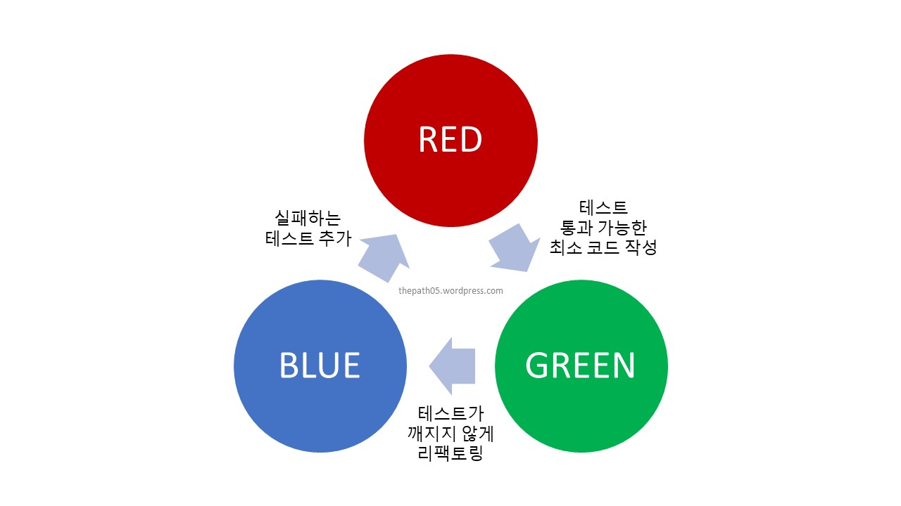

**_Speaker: MS 코리아 Solutions Architect 정보람님_**

## TDD는 설계-구현-테스트 의 사이클을 빠르게 변하는 요구사항에 맞추기 좋게 하기 위한 것

_TDD lifecycle_

볼링 게임 – TDD계의 Hello, World!

## TDD pros & cons

<table>
  <th>pros</th>
  <th>pros</th>
  <tr>
    <td>
      <ul>
        <li>코드 품질 향상</li>
        <li>확장이 용이</li>
        <li>최소기능 단위로 개발해서 수정 및 디버깅이 쉬움</li>
      </ul>
    </td>
    <td>
      <ul>
        <li>초기투자시간 大</li>
        <li>테스트 코드를 작성하기 어려움</li>
        <li>개발 속도가 느리다</li>
      </ul>
    </td>
  </tr>
</table>

stub & mock 참고하기

## TDD 자체가 프로젝트의 목적이 되어서는 주객전도. agile 도 TDD 도 “유연하게” 적용해야 한다!!

-> 공통 목표를 효율적으로 달성하기 위한 틀로만 활용!
ideal: 프로젝트 전체에 TDD 적용 (이러다가 고꾸라진 프로젝트가 많다)
reality: 복잡도가 높을 것으로 예상되는 부분만 부분적 도입!

## speaker 최근 관심:

**BDD: Behavior Driven Development**
- 비즈니스 요구사항에 집중
- 테스트를 요구사항과 최대한 비슷하게 설계 

**DDD: Domain Driven Development** 
- 테스트보다도 도메인이 중요 -> MSA 구조 시스템에 적합

## TDD examples

**1. 아무도 어떻게 작동하는지 모르는 레거시 프로젝트에서 새 기능 개발**

- 레거시 코드를 블랙박스로 취급
- 기존 코드에 대한 유닛 테스트를 작성
- 기존 코드 green 상태를 유지하면서 리팩토링
- 이후 새 기능을 TDD 기반으로 쌓기

**2. 사용자가 급증하여 버그 급증 –> 핫픽스 제공 –> 변경사항이 적용되고 고객지원 요구가 두배가 됨**

- 핫픽스가 기존의 코드를 깨트림
- 단위 테스트 assertion을 검증/재검토  
   => 코드가 문서화된 대로 작동한다는 증거 == 테스트!!

## TDD는 언제 쓰면 좋을까?

- 익숙하지 않은 프로젝트 주제
- 프로젝트 변경할 때 변경사항이 많은 경우
- 고객의 요구사항이 자주 바뀔경우
- 내가 개발하더라도 이 코드를 누가 유지보수할지 모를 경우

## TDD는 선택, “테스트” 는 필수!!!

test coverage는 해당 로직의 중요도에 따라서 결정  
-> 중요도 낮은 코드는 coverage 100%아니더라도 OK  
회사에서 테스트를 안시켜도 테스트는 꼭!! 하자

live service 기준 일반적으로 test coverage는 70~80% 가 일반적  
현실적으론 30% 이하도 많다…

TDD (unit test를 사용한) 는 작은 로직들을 위한 것  
큰 로직 테스트는 인수 검사 (acceptance test) 를 하자!
